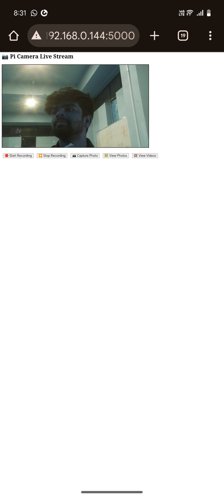

# 📷 Raspberry Pi Camera Web Interface

This project provides a **Flask-based web interface** for controlling the Raspberry Pi Camera (using the Picamera2 library) with features like:

- 🔴 **Live Video Streaming**
- 📸 **Photo Capture**
- 🎥 **Video Recording**
- 🖼 **Gallery for Photos**
- 🎞 **Video Management (Download/Delete)**

<br>

## 🌐 Live Demo (Screen Recording)

🎥 **[Watch the Demo Video](https://drive.google.com/file/d/1tN9GXmrUrMlYJkjUUynQWDKrGcglQvjE/view?usp=sharing)**  


<br>

## 🛠 Features

| Feature         | Description |
|----------------|-------------|
| Live View       | Real-time camera feed via MJPEG stream |
| Start/Stop Recording | Capture high-quality videos and convert them to MP4 |
| Capture Photo   | Take and save still images asynchronously |
| Media Gallery   | View, download, or delete saved photos and videos |

<br>

## 📸 Screenshots

### 🔴 Live Camera Stream


<br>

## 🚀 Getting Started

### 🔧 Prerequisites

- Raspberry Pi 5 or similar (64-bit OS)
- PiCamera2 installed
- FFmpeg installed (`sudo apt install ffmpeg`)
- Python 3 & Flask installed
- OpenCV (`pip install opencv-python`)
- Threading and Picamera2 dependencies (`libcamera` pre-installed)

### 📦 Installation

```bash
# Clone this repository
git clone https://github.com/yourusername/pi-camera-web-interface.git
cd pi-camera-web-interface

# Install Python dependencies
pip install flask opencv-python

# Run the app
python3 app.py
